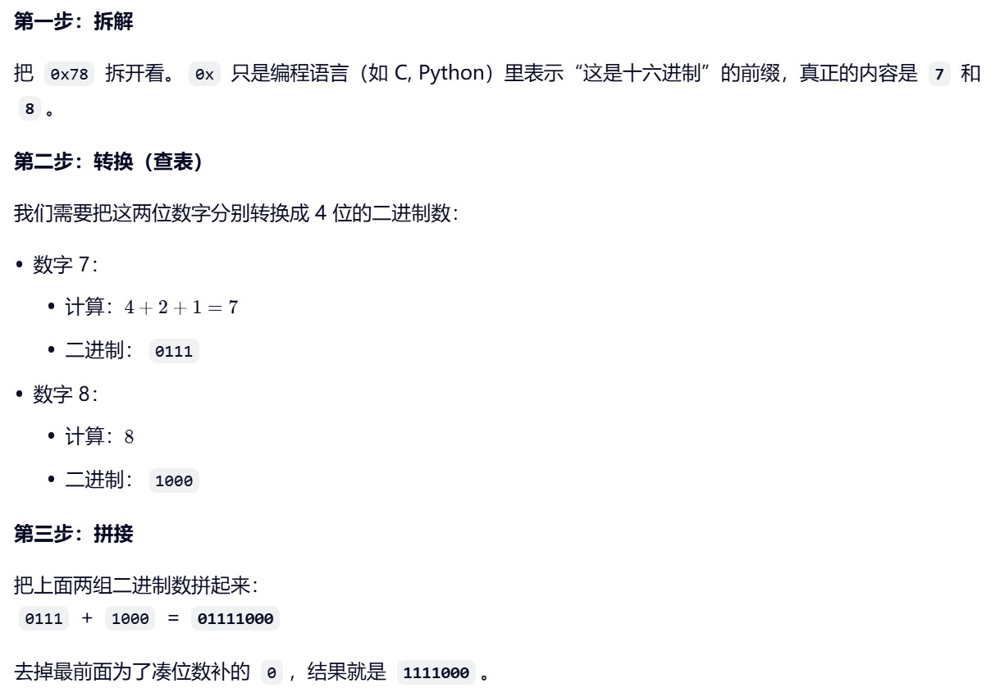

# I2C基本电路结构

## 1.串口的缺点
串口只能一对一传输

只有三个串口PIN：USART1/2/3
## 2.I2C总线基本结构

SCL:CLOCK

SDA:DATA

从机地址128个：0~127
## 3.详解SCL/SDL
**注意：SCL/SDA引脚都应设置为开漏输出！**

原因：
    
开漏输出0为低电压，1为高阻抗。SCL全写1（高阻抗），再由上拉电阻拉高电压，输出就为1；

若此时有一个是0（low），就会通路形成低电压，output为0

即可实现 **逻辑线与(&)** 运算
## 4.主机如何发送时钟信号
总线SCL写0，从机全写1：低电压

总线SCL写1，从机全写1：高电压

通过主机上的01，就向所有从机发送了01（时钟）信号
## 5.主机如何发送数据
总线SDA写0，从机全写1：低电压

总线SDA写1，从机全写1：高电压

同理时钟信号
## 6.从机如何发送数据
主机SDA线写1，无关从机写1，从机写0：低电压

主机SDA线写1，无关从机写1，从机写1：高电压

# I2C通信协议
## 起始位与停止位
起始位：SCL=High,SDA写0，下降沿
停止位：SCL=High,SDA写1，上升沿
## 寻址
起始位
|
7位地址+RW#
|
read为1
|
write为0
|
ACK:应答（**应答的是接收方**）
|
数据
|
停止位

## 补漏：16进制转2进制
0x只是语言，表示16进制

## 例子

