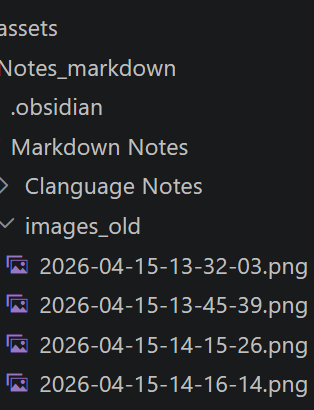

# 我的待办清单
#### 生活像是一盒巧克力
- 1.打开vscode
- 2.新建markdown文件
- 3.学习写笔记
- 4.跑步
# 常用快捷键
- **c + sh + v** : 打开预览
- **c + B** : 加粗文字
- **c + i** : 斜体文字
- **c + alt + v** : 粘贴图片
- 
## 记得换行要加两次空格  
但是  
<u>只能在最小层级使用</u>  
看来带#的都是标题，无换行功能  
还算合理吧
# 重大更新：现已经可以直接换行了
eg：
1.
2.
3.
# 标记操作

TEST一下手机端同步速度
tt
ee
ss
tt
## test

